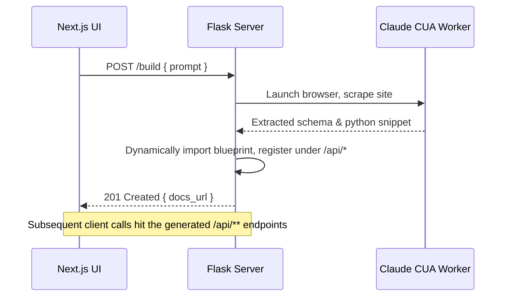

# **Docket** — Technical Description (Flask‑only, local‑first)

## Authors

Manit Mishra & Cursor (Claude‑powered) Development Agent

> **Purpose** — Build the simplest possible proof‑of‑concept that turns *anything* you can view in a browser into a one‑off REST/JSON API **running only on the hacker’s laptop**, with **zero external services, zero databases, and zero containers**.

---

## 1 · Project Overview

**Docket** takes a natural‑language prompt like:

> *“Give me an API that returns the price of Burger King fries by location.”*

…and, in a single Flask process, does the following:

1. Launches a **Claude Computer Use API** (CUA) session to open the Burger King web site via Chrome (Puppeteer).
2. Auto‑generates a small Flask *blueprint* that exposes one or more endpoints (e.g. `GET /fries?zip=95134`).
3. Registers that blueprint **in‑memory** under `/api/` and refreshes the built‑in Swagger UI.
4. Returns the Swagger link to the user so they can try the API locally (e.g. `http://localhost:5000/docs`).

Because everything happens on the attacker’s / hacker’s machine, normal scrape blockers don’t apply—the browser session is indistinguishable from a real user.

⚠️ **Deliberate constraints for the hackathon demo**

- **Single request at a time.** A global `threading.Lock()` ensures the next user prompt waits until the current one finishes.
- **Exactly one live API at a time.** Creating a new API **replaces** the old blueprint.
- **No Docker, no Traefik, no DB, no auth**—just raw Flask + CUA.

---

## 2 · High‑Level Architecture (local‑only)

```
┌──────────────────────┐      HTTP (JSON)      ┌────────────────┐
│ Next.js + Tailwind UI│ ────────────────────▶ │  Flask Core    │
│  (runs on :3000)     │                       │  (runs on :5000)│
└──────────────────────┘                       └──────┬─────────┘
                                                       │ Python API
                                                       ▼
                                            Claude CUA + Chrome
```

*Front‑end remains Next.js/Tailwind for rapid UI, but it is optional—you can POST with curl.*

---

## 3 · Key Technologies

| Layer                 | Tech                                           | Why                                     |
| --------------------- | ---------------------------------------------- | --------------------------------------- |
| **Frontend**          | Next.js 14 (App Router) + Tailwind + shadcn/ui | Quick form + Swagger iframe             |
| **Backend**           | **Flask 3.0** + Gunicorn (1 worker)            | Minimal overhead, easy blueprint reload |
| **Scraping**          | Claude CUA → Chrome (Puppeteer)                | Human‑like interaction, bypass blockers |
| **Docs**              | `flasgger` (auto‑Swagger)                      | Zero‑setup API docs                     |
| **Concurrency guard** | `threading.Lock()`                             | Enforce one‑at‑a‑time execution         |

*No database, no message queue, no container orchestration.*

---

## 4 · Runtime Flow



---

## 5 · Flask Core Design

```python
app = Flask(__name__)
lock = threading.Lock()
current_blueprint: Blueprint | None = None

@app.route("/build", methods=["POST"])
def build_api():
    if not lock.acquire(blocking=False):
        return {"error": "Busy. Try again later."}, 429
    try:
        prompt = request.json["prompt"]
        spec, code = generate_blueprint(prompt)  # Uses CUA under the hood
        global current_blueprint
        if current_blueprint:
            app.unregister_blueprint(current_blueprint)
        current_blueprint = compile_and_register(code)
        return {"docs_url": url_for("flasgger.apidocs")}, 201
    finally:
        lock.release()
```

- `generate_blueprint` calls Claude CUA, scrapes, and returns Python source for the blueprint + OpenAPI spec.\*

---

## 6 · Development Steps (Cursor‑friendly)

1. **Bootstrap repo**
   ```bash
   pnpm create next-app docket-frontend --tailwind
   python -m venv env
   pip install flask gunicorn flasgger anthropic openai python-dotenv
   ```
2. \`\`\*\* skeleton\*\* with `/health` and `/build` routes.
3. \*\*Implement thread‑safe \*\*\`\` as shown above.
4. **Integrate Flasgger** so `swagger.json` & `/docs` auto‑update after blueprint reload.
5. **Write ****\`\`**** util**
   - Ask Claude for scraping plan & code snippet.
   - Wrap snippet into template string plus OpenAPI YAML.
6. **Minimal Next.js UI**
   - Text area + "Generate" button (POST to `http://localhost:5000/build`).
   - After success, embed `iframe` pointing to `/docs`.
7. **Polish**
   - Handle Ctrl‑C cleanly.
   - README with one‑liner run commands:
     ```bash
     # backend
     gunicorn -w 1 -b 0.0.0.0:5000 app:app
     # frontend (optional)
     pnpm dev --filter docket-frontend
     ```

---

## 7 · Example Session (Burger King)

```bash
curl -X POST http://localhost:5000/build \
     -H "Content-Type: application/json" \
     -d '{"prompt":"API that fetches price of Burger King fries by location"}'
# → {"docs_url":"http://localhost:5000/docs"}

# Then call the generated endpoint:
curl "http://localhost:5000/api/fries?zip=95134"
```

Response:

```json
{
  "item":"Fries",
  "results":[
    {"location":"San Jose (Capitol Ave)","price":3.99},
    {"location":"Santa Clara (El Camino)","price":4.19}
  ]
}
```

---

## 8 · Stretch Ideas (post‑hackathon)

- **Multi‑prompt queue**: replace Lock with simple `asyncio.Queue`.
- **Persistent workspace**: write blueprints to `/generated` so they survive restarts.
- **SQLite cache**: optional local DB for previously generated APIs.

---

*End of Technical Description — version 0.3 (2025‑06‑19)*

